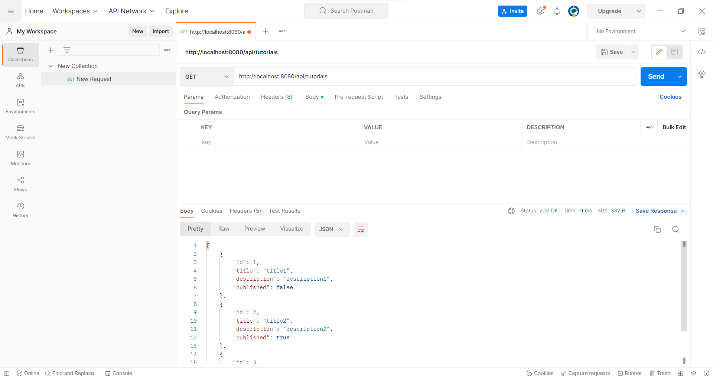
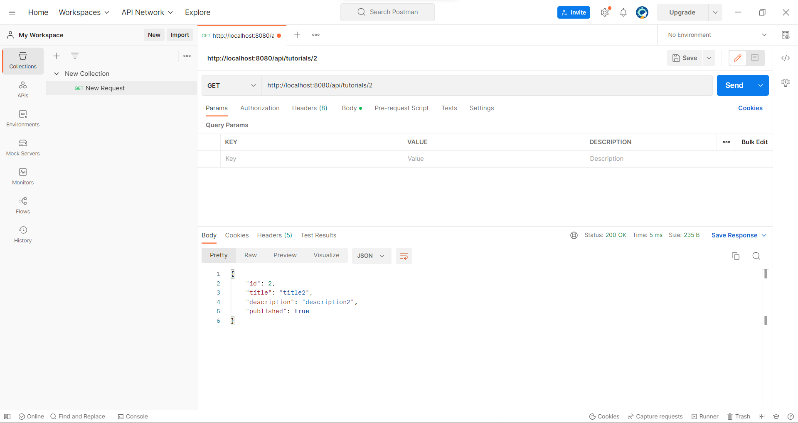
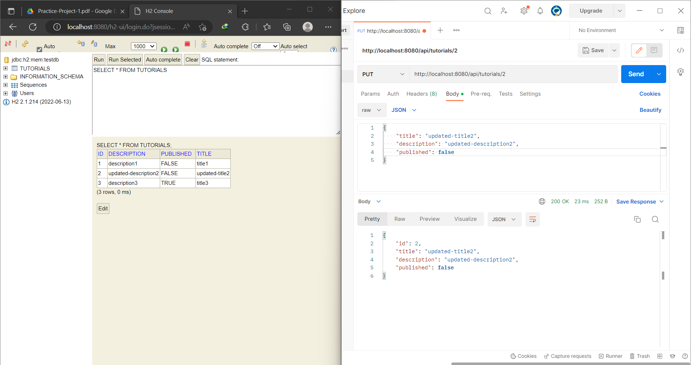
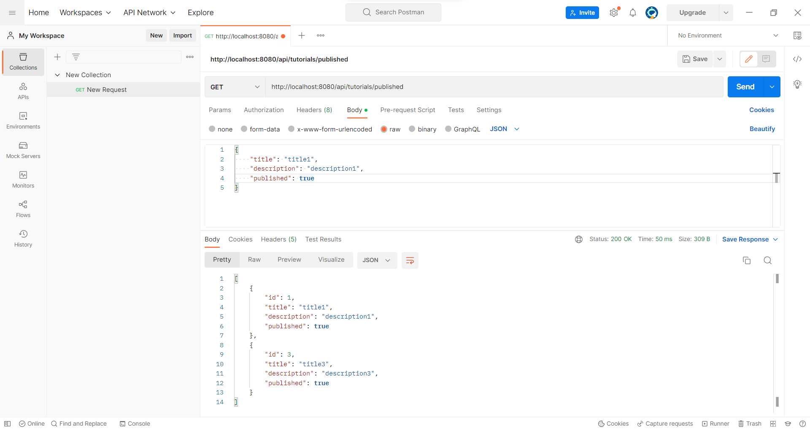
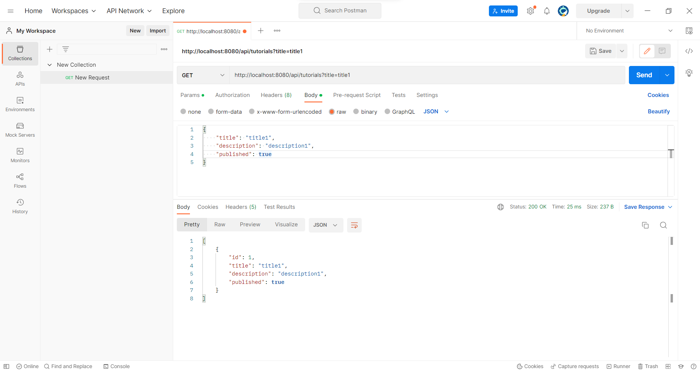
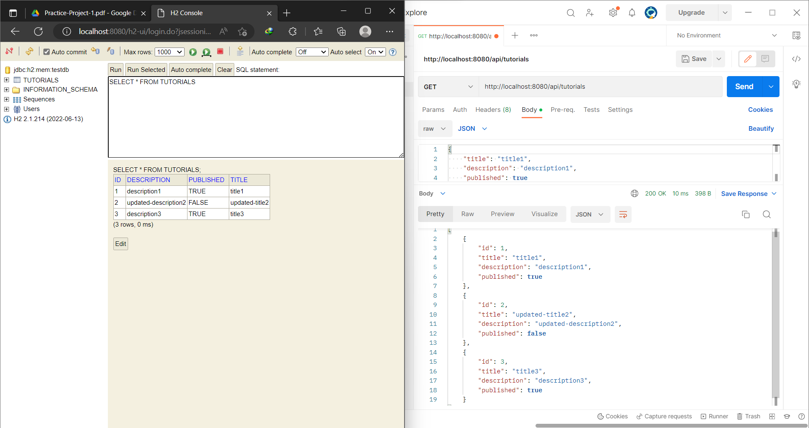
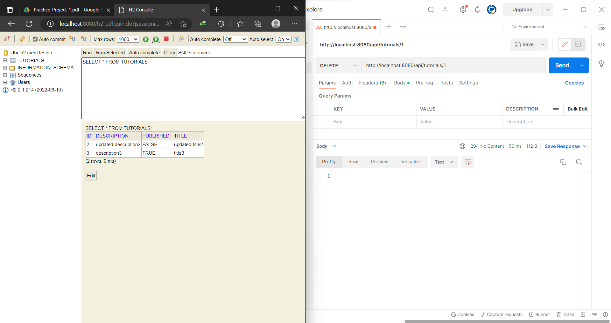
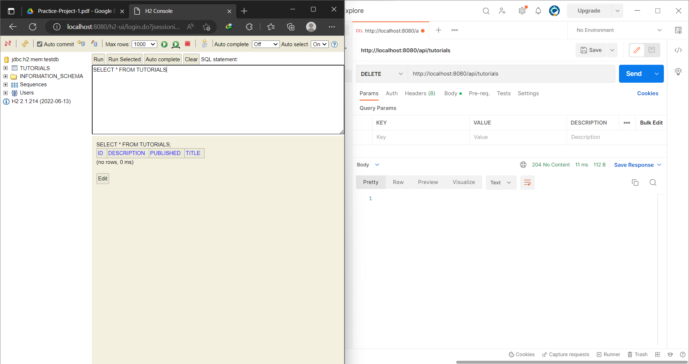

# PRACTICE PROJECT 1
# REST CRUD APIs WITH H2 DATABASE AND JPA
***

## POST /api/tutorials
Test API Create new tutorials

## GET /api
### GET /api/tutorials
Test API Get all tutorials

### GET /api/tutorials/{id}
Test API Get a specific tutorial by id (here id = 2)

## PUT /api/tutorials/{id}
Test API update a specific tutorial by id.
* This is "tutorial2" before updating

* After updating

## GET /api/tutorials/published
Get only published tutorials

## GET /api/tutorials?title=[keywork]
Test API get tutorials that have keyword in their title

## DELETE /api
### DELETE /api/tutorials/{id}
Delete tutorial by given id
* Before deleting

* After deleting tutorial id = 1

### DELETE /api/tutorials
Delete all tutorials in database

