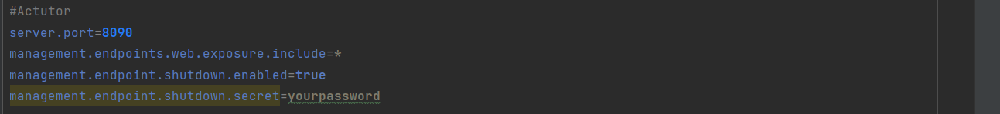
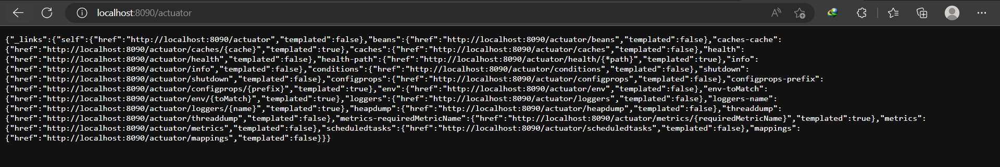

# PRACTICE WEEK 8.3
## Main contents:

  
Table of Contents

  <ol>
    <li><a href="#task-1">Task 1</a></li>
    <li><a href="#task-2">Task 2</a></li>
  </ol>

<h1 align="center">
   
  Spring Boot Practice
   
</h1>
<h4 align="center">Spring Boot Test, Actutor, DevTools</h4>

## Task1
1. Project Structure:
Using the old REST project

2. Test cases:
- _Code Test Repository_

- _Result TestCase Repository_

- _Code Test Service_
.png)
.png)
.png)
.png)
- _Result TestCase Service_

- _Code Test Controller_
.png)
.png)
.png)
.png)
.png)
- _Result TestCase Controller_

## Task2
1. Actutor:
- _Configure application.properties:_

- _Access endpoints:_

- _Access /actutor/health:_

- _Shutdown by actutor (with Postman):_

2. DevTools:
- _Changing port:_

- _Access endpoints with new port:_
